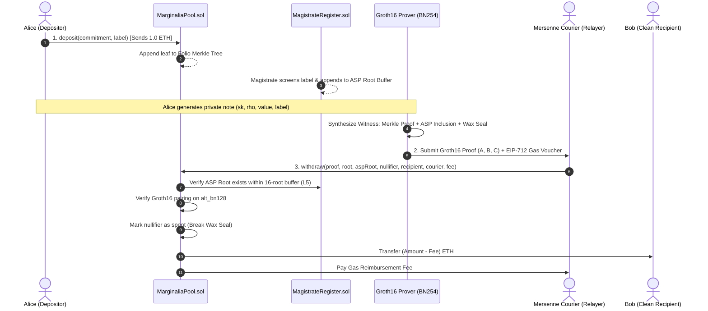

# MARGINALIA 📜⚖️

> *"Fermat asked the world to trust him. Marginalia asks no one to trust anyone."*

[-00C805?style=for-the-badge&logo=robinhood&logoColor=black)](https://rpc.testnet.chain.robinhood.com)
[](https://soliditylang.org/)
[](https://iden3.io/circom)
[](https://en.wikipedia.org/wiki/Zero-knowledge_proof)
[](LICENSE)
[](https://github.com/marginaliadev/marginalia/actions)

---

**MARGINALIA** is a zero-knowledge shielded asset pool engineered natively for the **Robinhood Chain**. Grounded in the mathematical lore of Pierre de Fermat and the Renaissance marginal notes, Marginalia achieves complete financial confidentiality without sacrificing regulatory compliance through **Association Set Providers (ASP)** and **Provable Exclusion Proofs**.

**Proven. Not revealed.**

---

## Table of Contents
- [1. 📜 Narrative Lore & The Three Axioms](#1--narrative-lore--the-three-axioms)
- [2. 🏛️ Core System Architecture](#2-️-core-system-architecture)
- [3. 🔬 Cryptographic Primitives](#3--cryptographic-primitives)
- [4. 🛡️ Association Set Provider (ASP) & Compliance](#4-️-association-set-provider-asp--compliance)
- [5. ⚡ Mersenne Courier (Gasless Relayer)](#5--mersenne-courier-gasless-relayer)
- [6. 🖥️ Web Application Suite (Noirpay Aesthetic)](#6-️-web-application-suite-noirpay-aesthetic)
- [7. 🚀 Quickstart & Local Setup](#7--quickstart--local-setup)
- [8. ⚙️ Robinhood Chain Configuration](#8-️-robinhood-chain-configuration)
- [9. 🧪 Test Suite & Invariants](#9--test-suite--invariants)
- [10. 🧭 Operations & Services](#10--operations--services)
- [11. 🗺️ Status & Roadmap](#11-️-status--roadmap)
- [12. 📄 License](#12--license)

---

## 1. 📜 Narrative Lore & The Three Axioms

In 1637, French mathematician Pierre de Fermat famously penned in the margin of his copy of Diophantus' *Arithmetica*:
> *"I have discovered a truly marvelous proof of this, which this margin is too narrow to contain."*

Traditional finance demands total surveillance to achieve compliance, while early privacy protocols forced users into unconditional obfuscation. Marginalia rejects this false dichotomy by introducing verifiable mathematics into the margins of the blockchain.

```
                           ┌─────────────────────────┐
                           │   MARGINALIA ECOSYSTEM  │
                           └────────────┬────────────┘
                                        │
             ┌──────────────────────────┼──────────────────────────┐
             ▼                          ▼                          ▼
     [ AXIOM I: WAX SEAL ]     [ AXIOM II: FOLIO TREE ]   [ AXIOM III: THE MAGISTRATE ]
       Nullifier Nonce            Poseidon Merkle Tree        ASP Association Set
    Prevent Double-Spend       Sublinear Proof O(log N)    Filter Illicit Capital
```

### The Three Axioms of Marginalia

1. **Axiom I (The Wax Seal)**:  
   *A Wax Seal cannot be broken twice.*  
   Every shielded deposit generates an ephemeral nullifier $\text{nullifierHash} = \text{Poseidon}_2(\text{sk}, \rho)$. Once presented in a valid withdrawal proof, the seal is permanently recorded in the contract state. Any subsequent attempt to spend the same commitment is reverted on-chain.

2. **Axiom II (The Folio Tree)**:  
   *Every marginal note is anchored in the grand book without disclosing its page.*  
   Notes are hashed into commitments $C = \text{Poseidon}_3(\text{value}, \text{label}, \text{precommitment})$ and appended to an on-chain Poseidon Merkle Tree of depth 20 (accommodating $2^{20} = 1,048,576$ notes). Proof of membership is verified in $O(\log N)$ constraints inside the Groth16 circuit.

3. **Axiom III (The Magistrate)**:  
   *Clean capital cannot be tainted by association.*  
   Withdrawal requires proving membership in an Association Set Provider (ASP) root approved by The Magistrate (`MagistrateRegister.sol`). Clean depositors prove their deposit label resides in the clean set, cryptographically severing ties with sanctioned actors without revealing their identity.

---

## 2. 🏛️ Core System Architecture



---

## 3. 🔬 Cryptographic Primitives

- **Elliptic Curve**: `alt_bn128` (BN254 curve, $y^2 = x^3 + 3$, prime order $r = 21888242871839275222246405745257275088548364400416034343698204186575808495617$).
- **Hash Function**: **Poseidon** Sponge construction optimized for R1CS algebraic circuits (circomlib).
- **Proving System**: **Groth16** Zero-Knowledge SNARK with minimal 3-element verification:
  $$e(A, B) = e(\alpha, \beta) + e(x \cdot \gamma, \delta) + e(C, \delta)$$
- **Folio Merkle Tree**: 20-level binary tree with hardcoded precomputed zero-hashes (`zeroHashes[20]`), allowing ultra-efficient insertion gas (~950k gas).

---

## 4. 🛡️ Association Set Provider (ASP) & Compliance

Marginalia implements the Privacy Pools paradigm to satisfy global AML/CFT standards (including OFAC, FATF Travel Rule, and regional compliance):

1. **Sliding-Window ASP Root Buffer**:  
   To prevent proof-invalidation races when the Magistrate updates the sanctions/approval registry, `MagistrateRegister.sol` maintains a circular buffer of the last **16 valid ASP roots**. Proofs computed against any recent root within the buffer remain valid.
2. **Letter of Disclosure**:  
   Users can cryptographically derive a selective disclosure certificate from their viewing key:
   $$\text{DisclosureKey} = \text{Poseidon}_2(\text{sk}, \text{SALT})$$
   This proves the origin of funds to an auditor without giving them custody or the ability to spend.
3. **Automated Magistrate** (`services/magistrate/`):
   A worker screens every deposit (OFAC public list, Chainalysis free sanctions API, a maintained list of known exploit addresses), builds the approved-label list, pins it to **IPFS** (two providers) and publishes only its Merkle root on-chain (`publishRoot(root, "ipfs://<cid>")`). Anyone can re-derive the root from the list, so integrity never depends on IPFS or on the web server. Roots are published at most every 15 minutes (the register keeps 16), screening failures stop publication instead of approving unscreened deposits, and every verdict change is kept in an append-only log.
4. **Safe governance**: the register owner and the pool guardian are a **2-of-3 Safe**; the Magistrate is a separate hot key that the Safe can replace. The guardian can pause *new deposits* only. Withdrawals and ragequit can never be paused.
5. **Ragequit (Emergency Capital Reclamation)**:  
The original depositing address can reclaim its deposit with `ragequit(label, recipient, proof)`, where `proof` is a small Groth16 proof (`circuits/ragequit.circom`) showing knowledge of `(sk, ρ)` behind the deposit's precommitment and revealing the note's **genuine** nullifier, which the pool burns. `sk` and `ρ` never appear in calldata. Because withdraw and ragequit burn the same nullifier, each note can be exited at most once by either path. ASP approval status is bookkeeping only, not a safety mechanism.

---

## 5. ⚡ Mersenne Courier (Gasless Relayer)

Recipients of private withdrawals typically have **zero ETH** in their freshly generated address. Marginalia solves this using the **Mersenne Courier**:
- Proof payloads specify `recipient`, `relayer`, and `fee`.
- The Courier submits the proof on-chain and pays the L2 gas fee.
- The contract atomically transfers `value - fee` to the recipient and `fee` to the courier.
- **Front-running protection**: `recipient` and `fee` are public circuit inputs; any relayer attempting to hijack the transaction invalidates the cryptographic proof instantly.
- **Fee quoting**: the fee is bound into the proof, so it is chosen before proving. The quote is the 90th percentile of the gas recent relays actually used (+5% headroom, +10% margin; a measured constant until enough relays exist). At relay time `eth_estimateGas` of the exact transaction must be covered by the fee, otherwise the relay is refused.
- **Health**: the Courier is offered only while its wallet holds enough gas money (`RELAYER_MIN_BALANCE_ETH`); the UI hides it and `/api/relay/withdraw` answers 503 otherwise, with a rate-limited alert webhook. A fee may not exceed 50% of the withdrawn value, and relays are serialised (one nonce sequence).

---

## 6. 🖥️ Web Application Suite (Noirpay Aesthetic)

The frontend is constructed using a high-density, mathematical Noirpay design system:

| Page | Route | Description |
| :--- | :--- | :--- |
| **Landing** | `/` | Showcase of the 3 Axioms, Pierre de Fermat narrative, interactive pipeline diagram, and real-time network telemetry. |
| **Shielded Cockpit** | `/app` | Deposit from your wallet, in-browser Groth16 proving (snarkjs), withdraw via wallet or Courier, ragequit, and the encrypted note vault. Crash recovery rebuilds a note from its secret if the page dies after a deposit. |
| **Codex** | `/codex` | Complete cryptographic documentation: BN254 algebra, R1CS constraint matrix, and smart contract invariants. |
| **Folio Explorer** | `/explorer` | Real-time Merkle leaf inspector, Wax Seal nullifier registry, and gas performance analytics. |
| **Compliance Desk** | `/compliance` | Screening policy and appeals process, and the Letter of Disclosure generator. |

---

## 7. 🚀 Quickstart & Local Setup

### Prerequisites
- Node.js `>= 22` (the SDK parity tests run TypeScript directly)
- npm `>= 10.0.0`

### Installation
```bash
# Clone the repository
git clone https://github.com/marginaliadev/marginalia.git
cd marginalia

# Install dependencies
npm install
```

### Run All Cryptographic & Contract Tests
```bash
npx hardhat test            # whole suite, no .env and no network needed (about 5-6 minutes)
npx hardhat test test/security_onchain.test.js   # one suite
```

### Launch the Web Application
```bash
cd frontend
cp .env.example .env.local   # see the comments inside for each variable
npm install
npm run dev                  # open http://localhost:3000 (use "localhost", not 127.0.0.1)
```
The legacy Express API (`npm start`, `server.js`) is no longer the front end; it remains for the CLI tooling and its tests.

---

## 8. ⚙️ Robinhood Chain Configuration

Copy `.env.example` to `.env`:
```bash
cp .env.example .env
```

Configure your Robinhood Chain parameters:
```env
# Robinhood Chain Testnet (Orbit L2)
RH_TESTNET_RPC_URL="https://rpc.testnet.chain.robinhood.com"
RH_TESTNET_CHAIN_ID=46630

# Robinhood Chain Mainnet
RH_MAINNET_RPC_URL="https://rpc.mainnet.chain.robinhood.com"
RH_MAINNET_CHAIN_ID=4663

# Deployer Key (Fund with testnet gas)
DEPLOYER_PRIVATE_KEY="0x..."

# Deployed Contract Addresses
MARGINALIA_POOL_ADDRESS="0x..."
MAGISTRATE_REGISTER_ADDRESS="0x..."
GROTH16_VERIFIER_ADDRESS="0x..."
```

Deploying to Robinhood Chain Testnet:
```bash
npm run deploy:testnet
```

---

## 9. 🧪 Test Suite & Invariants

`npx hardhat test` runs **230+ tests** on a local chain with no external services (CI runs the same). What each group defends:

| Group | Files | What it proves |
|---|---|---|
| Protocol | `marginalia`, `invariants`, `token_pool`, `mainnet_guard` | deposits, private withdrawals, change notes, ragequit, sliding ASP window, guardian pause |
| **Security (adversarial)** | `security_onchain` (21) | every admin call needs its role (exact custom error), forged/malleated proofs, front-running, replay, one exit door |
| **Circuit audit** | `circuit_audit` (31) | every withdraw input and every Merkle path element mutated: rejected (except `context`, bound on-chain); 128-bit overflow; differential vs JS |
| **Stateful fuzz** | `invariant_fuzz` | random sequences with a shadow model: value conservation, nullifier single use, root consistency |
| Magistrate | `magistrate_service`, `magistrate_policy`, `magistrate_supabase_store`, `asp_store` | idempotent, rate-limited, crash-safe publication; fail-closed screening; IPFS integrity; Supabase state |
| SDK parity | `merkle_bulk`, `browser_sdk_parity`, `gas_estimator` | the browser TypeScript SDK equals the Node SDK bit for bit |
| Ceremony | `ceremony_rehearsal`, `mainnet_ceremony_guard`, `reproducible_build` | full rehearsal with forgery detection; mainnet deploy refused without a real ceremony; reproducible builds |
| Gas | `gas_benchmark` | regression guard (fails above baseline + 2%): deposit ~945k, withdraw ~1.07M, ragequit ~321k |

On-chain / browser suites (need a funded testnet key): `scripts/test-governance.js` (real Safe v1.4.1), `scripts/test-relayer-health.js`, `scripts/test-browser-e2e.js` (headless Chrome driving the real UI with a crash-safe funds ledger).

---

## 10. 🧭 Operations & Services

| Piece | Where | Doc |
|---|---|---|
| Automated Magistrate worker | `services/magistrate/` (`npm run magistrate`) | `services/magistrate/README.md` |
| Safe governance scripts (transfer roles, rotate Magistrate, pause deposits) | `scripts/governance/` | `docs/incident_response_runbook.md` |
| Supabase schema, Fase 03 migration, check | `supabase/`, `node scripts/supabase-check.js` | the migration must be run once in the SQL editor |
| Trusted-setup ceremony toolkit | `scripts/ceremony/` | `docs/ceremony_guide.md` |
| Audit pack, circuit notes, threat model | `docs/audit/`, `docs/threat_model_and_audit_pack.md` | `node scripts/audit/manifest.js` |

---

## 11. 🗺️ Status & Roadmap

| Phase | Status |
|---|---|
| 01 Prototype | Completed |
| 02 Testnet Alpha | **Completed**: deposit, in-browser proving, withdraw (wallet and Courier), ragequit, vault, verified on the live testnet |
| 03 Hardening | **Active**: automated Magistrate, IPFS lists, Safe governance, relayer health and fee quoting are built and tested (`docs/phase3_hardening_report.md`); rollout (worker deployment, soak, moving roles to the Safe) is pending |
| 04 Audit & Ceremony | **Upcoming**: audit pack, internal circuit audit, fuzzing, ceremony toolkit and rehearsal are ready (`docs/phase4_audit_ceremony_report.md`); external audits and the public ceremony are not done |
| 05 Mainnet | Not started. **Technically blocked:** the committed proving keys are a single-party dev setup and `scripts/deploy.js` refuses chain 4663 without ceremony transcripts |

> **Testnet only. Not audited.** Do not deposit funds you cannot lose.

---

## 12. 📄 License

This project is licensed under the **MIT License** - see the [LICENSE](LICENSE) file for details.

---

<p align="center">
  <b>MARGINALIA RESEARCH & DEVELOPMENT</b><br>
  <i>"Proven. Not revealed."</i>
</p>
