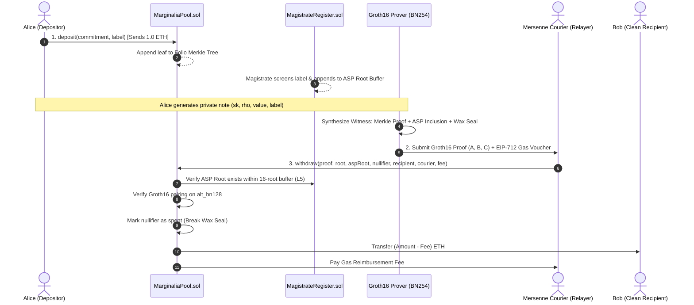

# MARGINALIA 📜⚖️

> *"Fermat asked the world to trust him. Marginalia asks no one to trust anyone."*

[-00C805?style=for-the-badge&logo=robinhood&logoColor=black)](https://rpc.testnet.chain.robinhood.com)
[](https://soliditylang.org/)
[](https://iden3.io/circom)
[](https://en.wikipedia.org/wiki/Zero-knowledge_proof)
[](LICENSE)
[](https://github.com/marginaliadev/marginalia/actions)

---

**MARGINALIA** is a zero-knowledge shielded asset pool engineered natively for the **Robinhood Chain**. Grounded in the mathematical lore of Pierre de Fermat and the Renaissance marginal notes, Marginalia achieves complete financial confidentiality without sacrificing regulatory compliance through **Association Set Providers (ASP)** and **Provable Exclusion Proofs**.

**Proven. Not revealed.**

---

## Table of Contents
- [1. 📜 Narrative Lore & The Three Axioms](#1--narrative-lore--the-three-axioms)
- [2. 🏛️ Core System Architecture](#2-️-core-system-architecture)
- [3. 🔬 Cryptographic Primitives](#3--cryptographic-primitives)
- [4. 🛡️ Association Set Provider (ASP) & Compliance](#4-️-association-set-provider-asp--compliance)
- [5. ⚡ Mersenne Courier (Gasless Relayer)](#5--mersenne-courier-gasless-relayer)
- [6. 🖥️ Web Application Suite (Noirpay Aesthetic)](#6-️-web-application-suite-noirpay-aesthetic)
- [7. 🚀 Quickstart & Local Setup](#7--quickstart--local-setup)
- [8. ⚙️ Robinhood Chain Configuration](#8-️-robinhood-chain-configuration)
- [9. 🧪 Test Suite & Invariants](#9--test-suite--invariants)
- [10. 📄 License](#10--license)

---

## 1. 📜 Narrative Lore & The Three Axioms

In 1637, French mathematician Pierre de Fermat famously penned in the margin of his copy of Diophantus' *Arithmetica*:
> *"I have discovered a truly marvelous proof of this, which this margin is too narrow to contain."*

Traditional finance demands total surveillance to achieve compliance, while early privacy protocols forced users into unconditional obfuscation. Marginalia rejects this false dichotomy by introducing verifiable mathematics into the margins of the blockchain.

```
                           ┌─────────────────────────┐
                           │   MARGINALIA ECOSYSTEM  │
                           └────────────┬────────────┘
                                        │
             ┌──────────────────────────┼──────────────────────────┐
             ▼                          ▼                          ▼
     [ AXIOM I: WAX SEAL ]     [ AXIOM II: FOLIO TREE ]   [ AXIOM III: THE MAGISTRATE ]
       Nullifier Nonce            Poseidon Merkle Tree        ASP Association Set
    Prevent Double-Spend       Sublinear Proof O(log N)    Filter Illicit Capital
```

### The Three Axioms of Marginalia

1. **Axiom I (The Wax Seal)**:  
   *A Wax Seal cannot be broken twice.*  
   Every shielded deposit generates an ephemeral nullifier $\text{nullifierHash} = \text{Poseidon}_2(\text{sk}, \rho)$. Once presented in a valid withdrawal proof, the seal is permanently recorded in the contract state. Any subsequent attempt to spend the same commitment is reverted on-chain.

2. **Axiom II (The Folio Tree)**:  
   *Every marginal note is anchored in the grand book without disclosing its page.*  
   Notes are hashed into commitments $C = \text{Poseidon}_3(\text{value}, \text{label}, \text{precommitment})$ and appended to an on-chain Poseidon Merkle Tree of depth 20 (accommodating $2^{20} = 1,048,576$ notes). Proof of membership is verified in $O(\log N)$ constraints inside the Groth16 circuit.

3. **Axiom III (The Magistrate)**:  
   *Clean capital cannot be tainted by association.*  
   Withdrawal requires proving membership in an Association Set Provider (ASP) root approved by The Magistrate (`MagistrateRegister.sol`). Clean depositors prove their deposit label resides in the clean set, cryptographically severing ties with sanctioned actors without revealing their identity.

---

## 2. 🏛️ Core System Architecture



---

## 3. 🔬 Cryptographic Primitives

- **Elliptic Curve**: `alt_bn128` (BN254 curve, $y^2 = x^3 + 3$, prime order $r = 21888242871839275222246405745257275088548364400416034343698204186575808495617$).
- **Hash Function**: **Poseidon** Sponge construction optimized for R1CS algebraic circuits (circomlib).
- **Proving System**: **Groth16** Zero-Knowledge SNARK with minimal 3-element verification:
  $$e(A, B) = e(\alpha, \beta) + e(x \cdot \gamma, \delta) + e(C, \delta)$$
- **Folio Merkle Tree**: 20-level binary tree with hardcoded precomputed zero-hashes (`zeroHashes[20]`), allowing ultra-efficient insertion gas (~950k gas).

---

## 4. 🛡️ Association Set Provider (ASP) & Compliance

Marginalia implements the Privacy Pools paradigm to satisfy global AML/CFT standards (including OFAC, FATF Travel Rule, and regional compliance):

1. **Sliding-Window ASP Root Buffer**:  
   To prevent proof-invalidation races when the Magistrate updates the sanctions/approval registry, `MagistrateRegister.sol` maintains a circular buffer of the last **16 valid ASP roots**. Proofs computed against any recent root within the buffer remain valid.
2. **Letter of Disclosure**:  
   Users can cryptographically derive a selective disclosure certificate from their viewing key:
   $$\text{DisclosureKey} = \text{Poseidon}_2(\text{sk}, \text{SALT})$$
   This proves the origin of funds to an auditor without giving them custody or the ability to spend.
3. **Ragequit (Emergency Capital Reclamation)**:  
   If the Magistrate delays or rejects label inclusion, depositors retain the unalienable right to execute `ragequit(commitment)` directly from the original depositing address, safely reclaiming their locked ETH.

---

## 5. ⚡ Mersenne Courier (Gasless Relayer)

Recipients of private withdrawals typically have **zero ETH** in their freshly generated address. Marginalia solves this using the **Mersenne Courier**:
- Proof payloads specify `recipient`, `relayer`, and `fee`.
- The Courier submits the proof on-chain and pays the L2 gas fee.
- The contract atomically transfers `value - fee` to the recipient and `fee` to the courier.
- **Front-running protection**: `recipient` and `fee` are public circuit inputs; any relayer attempting to hijack the transaction invalidates the cryptographic proof instantly.

---

## 6. 🖥️ Web Application Suite (Noirpay Aesthetic)

The frontend is constructed using a high-density, mathematical Noirpay design system:

| Page | Route | Description |
| :--- | :--- | :--- |
| **Landing** | `/` (`index.html`) | Showcase of the 3 Axioms, Pierre de Fermat narrative, interactive pipeline diagram, and real-time network telemetry. |
| **Shielded Cockpit** | `/app` (`app.html`) | Full deposit vault, live WebAssembly Groth16 terminal prover, ragequit recovery, and encrypted note vault. |
| **Codex** | `/codex` (`codex.html`) | Complete cryptographic documentation: BN254 algebra, R1CS constraint matrix, and smart contract invariants. |
| **Folio Explorer** | `/explorer` (`explorer.html`) | Real-time Merkle leaf inspector, Wax Seal nullifier registry, and gas performance analytics. |
| **Compliance Desk** | `/compliance` (`compliance.html`) | Magistrate ASP audit portal, OFAC/AML association screening, and Letter of Disclosure generator. |

---

## 7. 🚀 Quickstart & Local Setup

### Prerequisites
- Node.js `>= 20.0.0`
- npm `>= 10.0.0`

### Installation
```bash
# Clone the repository
git clone https://github.com/marginaliadev/marginalia.git
cd marginalia

# Install dependencies
npm install
```

### Run All Cryptographic & Contract Tests
```bash
# Runs the 18 comprehensive invariant and circuit tests
npx hardhat test
```

### Launch the Web Application
```bash
npm start
# Server listening on http://localhost:3000
```
Open `http://localhost:3000` in your browser.

---

## 8. ⚙️ Robinhood Chain Configuration

Copy `.env.example` to `.env`:
```bash
cp .env.example .env
```

Configure your Robinhood Chain parameters:
```env
# Robinhood Chain Testnet (Orbit L2)
RH_TESTNET_RPC_URL="https://rpc.testnet.chain.robinhood.com"
RH_TESTNET_CHAIN_ID=46630

# Robinhood Chain Mainnet
RH_MAINNET_RPC_URL="https://rpc.mainnet.chain.robinhood.com"
RH_MAINNET_CHAIN_ID=4663

# Deployer Key (Fund with testnet gas)
DEPLOYER_PRIVATE_KEY="0x..."

# Deployed Contract Addresses
MARGINALIA_POOL_ADDRESS="0x..."
MAGISTRATE_REGISTER_ADDRESS="0x..."
GROTH16_VERIFIER_ADDRESS="0x..."
```

Deploying to Robinhood Chain Testnet:
```bash
npm run deploy:testnet
```

---

## 9. 🧪 Test Suite & Invariants

Marginalia enforces strict mathematical invariants verified in `test/marginalia.test.js`:

```
  MARGINALIA shielded pool
    ✔ off-chain Merkle tree matches the on-chain Folio (empty + after inserts)
    ✔ on-chain commitment equals Poseidon(value, label, precommitment)
    ✔ full withdrawal to a fresh address via a relayer
    ✔ partial withdrawal, then spend the change note
    ✔ Axiom I: a Wax Seal cannot be broken twice (double-spend protection)
    ✔ Axiom III: an unapproved label cannot produce a proof against the Register
    ✔ front-running: changing recipient or fee invalidates the proof
    ✔ cannot withdraw more than the note holds
    ✔ reports gas for deposit and withdraw (deposit: ~956k gas, withdraw: ~1.07M gas)
    ✔ tampered public signals are rejected by the verifier
    ✔ only the Magistrate can publish Register roots
    ✔ note serialization round-trips
    Ragequit (Emergency Exit)
      ✔ allows original depositor to ragequit an unapproved deposit and recover funds
      ✔ prevents non-depositor from ragequitting someone else's deposit
      ✔ prevents double ragequit
      ✔ prevents shielded ZK withdrawal on a note that was ragequitted
      ✔ prevents ragequitting a note that has already been withdrawn via ZK proof
    Sliding-Window ASP Root Buffer (L5 Mitigation)
      ✔ accepts proof generated against a previous root within the 16-root historical window

  18 passing (26s)
```

---

## 10. 📄 License

This project is licensed under the **MIT License** — see the [LICENSE](LICENSE) file for details.

---

<p align="center">
  <b>MARGINALIA RESEARCH & DEVELOPMENT</b><br>
  <i>"Proven. Not revealed."</i>
</p>
