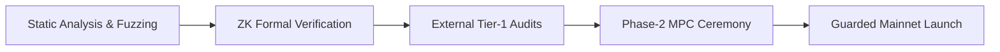

# MARGINALIA — Engineering Master Plan & Roadmap
**Author:** Senior Staff Blockchain & ZK Engineer (20+ Years Systems Architecture)  
**Project:** Marginalia Shielded Pool (Robinhood Chain / Arbitrum Orbit L2)  
**Target Standard:** Institutional-grade, Compliant Zero-Knowledge Privacy Pool  
**Version:** 1.0.0-PROD-PLAN  

---

## Executive Summary & Architectural Vision

MARGINALIA is a compliant zero-knowledge privacy pool implementing an Association Set Provider (ASP) model on the Robinhood Chain (Arbitrum Orbit L2). Built upon BN254 Groth16 zk-SNARKs and Poseidon hashing, it achieves privacy preservation without sacrificing regulatory defensibility.

This document lays out the **Master Engineering Plan** to transition MARGINALIA from its current **Phase 0 (Working CLI Prototype)** into an **audited, battle-tested, high-performance production system (Phase 1 through Phase 4)**.

```
┌──────────────────────────────────────────────────────────────────────────────────────────────────┐
│                                       MARGINALIA ECOSYSTEM                                       │
├───────────────────────────────┬──────────────────────────────────┬───────────────────────────────┤
│          CLIENT TIER          │          RELAYER & ASP           │        ON-CHAIN ENGINE        │
│  • Next.js WebApp (wagmi/viem)│  • Mersenne Courier Relayer Net  │  • MarginaliaPool (ETH & ERC) │
│  • Web Worker Groth16 Prover  │  • Magistrate ASP Screening Svc  │  • MagistrateRegister (ASP)   │
│  • EIP-712 Encrypted Vault    │  • Ponder Realtime Indexer       │  • Groth16Verifier (BN254)    │
│  • Letter of Disclosure SDK   │  • IPFS Decoupled Label Registry │  • Inlined Yul Poseidon (Gas) │
└───────────────────────────────┴──────────────────────────────────┴───────────────────────────────┘
```

---

## 1. Operational & Runtime Setup (Immediate Execution)

Before executing advanced roadmap items, the local development and testing environment must be bootstrapped and automated into continuous integration.

### 1.1 Dependency Installation & Workspace Initialization
* **Objective:** Establish reproducible environment with pinned compiler versions.
* **Actions:**
  1. Verify system prerequisites:
     * Node.js `v22.x LTS`
     * Rust `1.80+` and `cargo`
     * Circom `v2.2.2` (`circom --version`)
  2. Execute `npm install` to hydrate `node_modules/`.
  3. Create local `.env` from [.env.example](file:///d:/Real%20Kerja/marginalia/.env.example):
     ```bash
     cp .env.example .env
     ```
  4. Ensure `.gitignore` safely covers runtime secrets:
     * `.env`
     * `notes/`
     * `deployments/`
     * `asp/`

### 1.2 Local Devnet Orchestration & Automated Smoke Pipeline
Create a unified orchestration script `scripts/dev-bootstrap.js` to automate the local runtime lifecycle in one command:

```
[Start hardhat node] ──► [Deploy 5 Contracts] ──► [Save deployments/localhost.json]
                               │
[Spend Change Note] ◄── [Withdraw] ◄── [Magistrate Approve] ◄── [Deposit 0.5 ETH]
```

* **Contract Deployment (`deployments/localhost.json`):**
  Deploys `PoseidonT3`, `PoseidonT4`, `Groth16Verifier`, `MagistrateRegister`, and `MarginaliaPool`.
* **Runtime Directory Generation:**
  * `deployments/`: Contains contract addresses and deployment block numbers.
  * `notes/`: Stores generated deposit notes.
  * `asp/`: Stores approved label sets and ASP Merkle trees.

---

## 2. Phase 1: Testnet Alpha & Core Security Remediation

Phase 1 focuses on mitigating critical single-point vulnerabilities (L3, L6, L11) and delivering a web interface.

### 2.1 Feature: Emergency Exit / "Ragequit" Mechanism (Remediation for L3)
* **Problem:** If a depositor's note is rejected or unreviewed by the Magistrate ASP, the user's funds are permanently trapped in the pool.
* **Architecture Solution:**
  Add a `ragequit(uint256 precommitment, uint256 index, address recipient)` function to [MarginaliaPool.sol](file:///d:/Real%20Kerja/marginalia/contracts/MarginaliaPool.sol):
  1. Only the original `labelDepositor[label]` (or an authorized depositor) can trigger ragequit.
  2. The pool verifies that the note has **not** been approved in the latest ASP root OR that an exit delay (e.g., 7 days) has elapsed without ASP clearance.
  3. A dedicated nullifier for ragequit (`N_exit = Poseidon(precommitment, "RAGEQUIT")`) is marked spent to prevent both double-exit and subsequent shielded withdrawal.
  4. Returns `value` to the depositor minus an exit penalty or protocol gas fee.

### 2.2 Feature: Client-Side Note Encryption Module (Remediation for L6)
* **Problem:** Storing secret notes in plaintext (`marginalia-note-v1-...`) risks total fund loss if client storage or disk is compromised.
* **Architecture Solution:**
  * Implement an **Encrypted Vault Subsystem** in `lib/vault.js`:
    ```
    Wallet Signature (EIP-712: "Marginalia Vault Access")
                   │
                   ▼
        PBKDF2 / HKDF-SHA256 (Salt: ChainID + PoolAddress)
                   │
                   ▼
          AES-256-GCM Master Key
                   │
        ┌──────────┴──────────┐
        ▼                     ▼
    Local Encrypted     Encrypted Cloud/Backup
    IndexedDB           Export Payload
    ```
  * Note format becomes an encrypted JWE or authenticated ciphertext `marginalia-vault-v1-<iv>-<tag>-<ciphertext>`.

### 2.3 Feature: Real-Time Event Indexer (Remediation for L11)
* **Problem:** Querying RPC `eth_getLogs` across millions of blocks on L2 triggers RPC timeouts and rate-limits.
* **Architecture Solution:**
  * Deploy **Ponder** (TypeScript-first EVM indexer) in `indexer/`:
    * Tracks `LeafInserted`, `Deposited`, `Withdrawn`, and `RootPublished`.
    * Maintains an off-chain incremental Merkle tree cache (depth 20) with sub-second query latency.
    * Exposes a GraphQL & REST endpoint:
      * `GET /merkle-path?leaf=<commitment>`: Returns pre-computed 20-depth sibling paths.
      * `GET /asp-tree?root=<latestRoot>`: Returns proof of membership for approved labels.
      * Client verifies root against on-chain `MarginaliaPool.isKnownRoot()` before using witness.

### 2.4 Feature: Minimal Web UI (Next.js + wagmi + WebWorker snarkjs)
* **Technology Stack:**
  * Framework: Next.js 14/15 (App Router, Server Actions)
  * Web3: `wagmi`, `viem`, `@tanstack/react-query`
  * Styling: Vanilla CSS / Modern Glassmorphism dark mode (TailwindCSS only if needed)
  * ZK Engine: `snarkjs` running inside a dedicated **Web Worker**.
* **Key UX Features:**
  * **Non-blocking Prover:** Groth16 witness generation (~3.6s) runs in a background worker with visual progress bars (`Witness calculated` -> `Proving statement` -> `Proof generated`).
  * **Anonymity Set Visualizer:** Shows the current depth and active note count in the Folio.
  * **Denomination Presets:** Suggests round values (0.1, 0.5, 1.0, 5.0 ETH) to mitigate metadata leakage via unique values.

---

## 3. Phase 2: Protocol Hardening & Institutional Extensions

### 3.1 Feature: Mersenne Courier — Relayer Microservice (Remediation for L7)
* **Problem:** Direct withdrawal from a user's wallet links the destination address with the gas-paying address, breaking privacy.
* **Architecture Solution:**
  * Build a standalone Relayer daemon (`services/relayer/`):
    1. Endpoint: `POST /relay/withdraw`
    2. Payload: `{ withdrawal: Withdrawal, proof: Proof }`
    3. Verification: Simulates `MarginaliaPool.withdraw` via `eth_call`. Validates `fee >= estimatedGas * gasPrice + margin`.
    4. Execution: Dispatches transaction from the Relayer's operational hot wallet.
    5. Deducts fee on-chain: `fee` is transferred directly to `relayer` address during pool execution.

### 3.2 Feature: Magistrate Decentralization & Sliding Window ASP (Remediation for L4 & L5)
* **Decentralized ASP Registry:**
  * Migrate `MagistrateRegister` governance to a Gnosis Safe multisig.
  * Require ASP label datasets to be pinned to IPFS / Filecoin, with IPFS CID stored in `publishRoot(root, ipfsCid)`.
* **Sliding Window Root Buffer (Fix for L5):**
  * Modify [MarginaliaPool.sol](file:///d:/Real%20Kerja/marginalia/contracts/MarginaliaPool.sol) to accept the last **16 ASP roots** rather than strictly `register.latestRoot()`.
  * Eliminates transaction rejections (`StaleAspRoot`) when proofs are generated concurrently with ASP root updates.

### 3.3 Feature: Gas Optimization with Inlined Yul Poseidon (Remediation for L8)
* **Problem:** Current external calls to Poseidon contract (`PoseidonT3`, `PoseidonT4`) cost ~930k gas on deposit and ~1.07M on withdraw due to repeated `CALL` opcodes across 20 tree levels.
* **Architecture Solution:**
  * Replace external contracts with inlined assembly Poseidon (`poseidon-solidity` or custom Yul implementation).
  * Reduces deposit gas from **~930k to ~220k** and withdraw verification overhead significantly.

### 3.4 Feature: Multi-Asset & ERC-20 Support (Remediation for L9)
* **Architecture Solution:**
  * Create `MarginaliaTokenPool.sol`:
    * Utilizes `SafeERC20` for transfers.
    * ReentrancyGuard on all state-changing endpoints.
    * Integrates `balanceOf` difference checks before and after deposit to protect against fee-on-transfer / rebasing tokens.
    * Introduces `assetId` into commitment computation:
      $$cm = \text{Poseidon4}(value, assetId, label, pre)$$

### 3.5 Feature: Viewing Keys / Letter of Disclosure (Remediation for L10)
* **Problem:** Institutional compliance and tax disclosures require users to prove transactions to regulators without making them public.
* **Architecture Solution:**
  * Introduce an asymmetric disclosure key pair:
    * Viewing Public Key: $vpk = \text{Poseidon}(vsk)$
    * Ephemeral Key: $r$
  * At deposit time, emit an encrypted memo:
    $$C_{memo} = \text{AES-GCM-Encrypt}_{ECDH(r, vpk)}(value, label, \text{salt})$$
  * The user can share $vsk$ ("Letter of Disclosure") with auditors, enabling decrypting of their transaction history without relinquishing spending power.

---

## 4. Phase 3 & 4: Audits, Formal Verification & Production Launch



### 4.1 Automated Security Verification Suite
* **Contract Analysis:** Slither, Aderyn, Echidna property-based fuzzing.
* **ZK Circuit Verification:**
  * **Circomspect:** Detect under-constrained signal bugs and unconstrained assignments.
  * **Picus / Ecne:** Formal proof of uniqueness of witness.

### 4.2 Phase-2 Trusted Setup Ceremony
* Conduct a community-driven Phase-2 ceremony using the `p0tion` ceremony platform.
* Ensure a minimum of 50 independent contributors across varied geographic locations and hardware platforms.
* Publish complete ceremony transcripts, blake2b hashes, and verification keys.

### 4.3 Guarded Launch & Risk Management (Robinhood Chain 4663)
1. **Deposit Caps:** Limit pool capacity to 10 ETH total for the first 30 days, expanding to 50 ETH in Month 2.
2. **Emergency Pause Guardian:** Implement an immutable 2-of-3 multisig guardian capable of pausing deposits (withdrawals remain permanently unpauseable to prevent hostage funds).
3. **Bug Bounty Program:** Launch Immunefi bug bounty with up to $250,000 for critical ZK circuit soundness vulnerabilities.

---

## 5. Structured Sprint Breakdown (Action Plan)

| Sprint | Focus Area | Deliverables | Target Timeline |
|:---:|---|---|:---:|
| **Sprint 1** | **Runtime & Bootstrap** | • Automated `.env` generator<br>• Local deploy pipeline (`deployments/`)<br>• Unit test automation and CI scripts | Week 1 |
| **Sprint 2** | **Exit & Security (L3, L6)** | • `ragequit.circom` and pool exit logic<br>• `lib/vault.js` EIP-712 client encryption<br>• 100% test coverage for exit paths | Weeks 2–3 |
| **Sprint 3** | **Indexer & Web UI** | • Ponder indexer deployment<br>• Next.js dashboard + Web Worker snarkjs prover<br>• Testnet Robinhood Chain (`46630`) deployment | Weeks 4–5 |
| **Sprint 4** | **Relayer & ASP Hardening** | • Mersenne Courier relayer daemon<br>• Sliding-window ASP root buffer (L5)<br>• IPFS metadata pinning for labels | Weeks 6–7 |
| **Sprint 5** | **Gas, ERC-20 & Viewing Keys** | • Yul Poseidon inlining (L8)<br>• `MarginaliaTokenPool.sol` (L9)<br>• Viewing key encryption & disclosure SDK (L10) | Weeks 8–9 |
| **Sprint 6** | **Auditing & Ceremony** | • Circomspect / Picus formal checks<br>• Independent external audit execution<br>• Phase-2 MPC Ceremony setup | Weeks 10–12 |

---

## Architectural Principles to Enforce

1. **"Never trust the client, never trust the relayer":** All state transitions and Merkle paths must be verified on-chain against root histories.
2. **Zero Knowledge ≠ Zero Compliance:** The ASP model guarantees that privacy is granted only to legitimate actors, safeguarding the protocol from illicit finance classification.
3. **Strict Immutability with Safe Exits:** Once verified, withdrawal rights must never be paused or censored by any protocol administrator.
